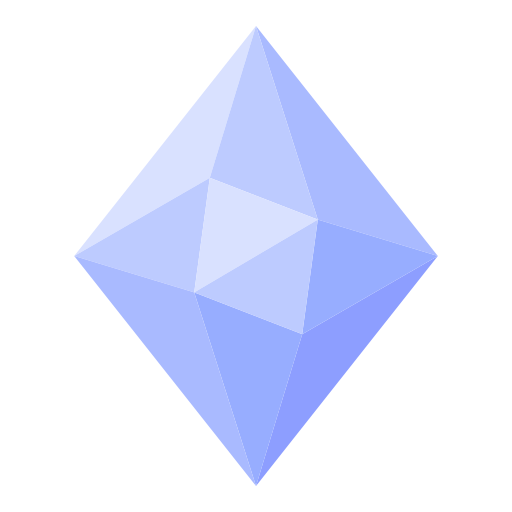

<p align="center">
  
</p>

<p>
  
</p>

<h2>
  
</h2>

<table align = "center">
  <tr>
    <td align="center" width="96">
      <a href = "https://www.instagram.com/const_art_sc/" alt = "const_art_sc | Instagram" target = "_blank"> 
      
      <a><br>Instagram
    </td>
    <td align="center" width="96">
      <a href = "https://www.linkedin.com/in/constantine-artemiou-727206331/" alt = "const_art_sc | LinkedIn" target = "_blank"> 
      
      <a><br>LinkedIn
    </td>
  </tr>
</table>

<p>
  
</p>

<h2>
  
</h2>

```yaml
Fullname: Constantine Artemiou
Nickname: ConstArt

Location: Chalkida, Central Greece
Education: University Of Piraeus

Interests:
[
  "Generative AI && ML",
  "Data Visualization",
  "Graphics Design",
  "Data Science",
  "UI-UX Design"
]

Hobbies:
[
  "Science",
  "Mathematics",
  "Philosophy"
]

CurrentWork:
[
  "Lexarithmos"
  "GenPhilosopherAI",
]
```

<p>
  
</p>

<h2>
  
</h2>

<table align = "center">
  <tr>
    <td align="center" width="96">
      
      <br>Python
    </td>
    <td align="center" width="96">
      
      <br>Java
    </td>
    <td align="center" width="96">
      
      <br>Html
    </td>
    <td align="center" width="96">
      
      <br>Css
    </td>
    <td align="center" width="96">
      
      <br>JavaScript
    </td>
  </tr>
  <tr>
    <td align="center" width="96">
      
      <br>Obsidian
    </td>
    <td align="center" width="96">
      
      <br>VsCode
    </td>
    <td align="center" width="96">
      
      <br>PyCharm
    </td>
    <td align="center" width="96">
      
      <br>Processing
    </td>
      <td align="center" width="96">
      
      <br>GitDesktop
    </td>
  </tr>
</table>

<p>
  
</p>

<p align="center">
  
</p>
