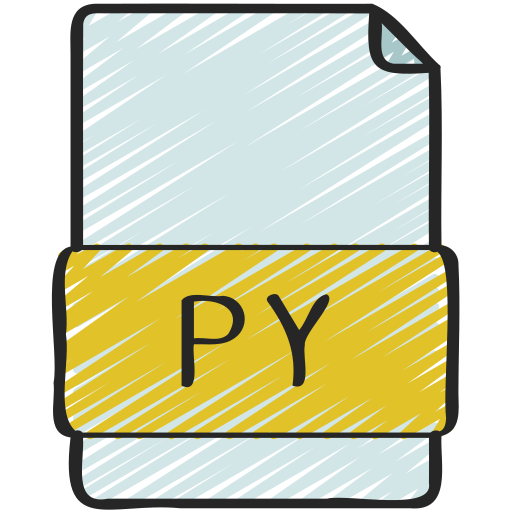
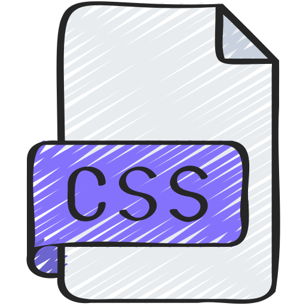
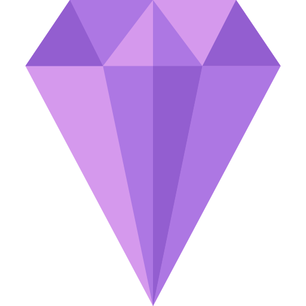

<p align="center">
  
</p>

<p>
  
</p>

<h2>
  
</h2>

<table align = "center">
  <tr>
    <td align="center" width="96">
      <a href = "https://www.instagram.com/const_art_sc/" alt = "const_art_sc | Instagram" target = "_blank"> 
      
      <a><br>Instagram
    </td>
    <td align="center" width="96">
      <a href = "https://www.linkedin.com/in/constantine-artemiou-727206331/" alt = "const_art_sc | LinkedIn" target = "_blank"> 
      
      <a><br>LinkedIn
    </td>
  </tr>
</table>

<p>
  
</p>

<h2>
  
</h2>

```yaml
Profile:
  Fullname: Constantine Artemiou
  Nickname: ConstArt
  Role: Creative Coder & AI Explorer
  Location: Chalkis, Central Greece
  Education: BSc Computer Science @ University of Piraeus
  Motto: "Blending imagination, science and AI, into artistic digital creations."

Interests:
  - 🤖 Generative AI & Machine Learning
  - 📊 Data Science & Visualization
  - 🖼️ Graphics & Computational Art
  - ✨ UI/UX Design

Hobbies:
  - 🎨 Art
  - 🔭 Science

CurrentWork:
  - 💡 AIQuoteGenerator -> A creative AI quote generator.
  - 🔒 CodeGenerator -> An AI code encrypted generator.
  - 📜 Lexarithmos -> Greek-Numbers transformer.
```

<p>
  
</p>

<h2>
  
</h2>

<table align = "center">
  <tr>
    <td align="center" width="96">
      
      <br>Python
    </td>
    <td align="center" width="96">
      
      <br>Java
    </td>
    <td align="center" width="96">
      
      <br>Html
    </td>
    <td align="center" width="96">
      
      <br>Css
    </td>
    <td align="center" width="96">
      
      <br>JavaScript
    </td>
  </tr>
  <tr>
    <td align="center" width="96">
      
      <br>Obsidian
    </td>
    <td align="center" width="96">
      
      <br>VsCode
    </td>
    <td align="center" width="96">
      
      <br>PyCharm
    </td>
    <td align="center" width="96">
      
      <br>Processing
    </td>
      <td align="center" width="96">
      
      <br>GitDesktop
    </td>
  </tr>
</table>

<p>
  
</p>

<p align="center">
  
</p>
