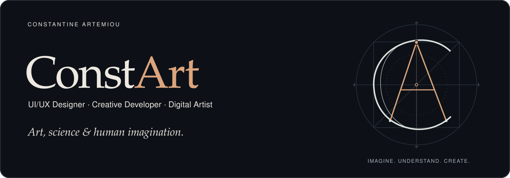

  

  <h3>UI/UX Designer&nbsp;·&nbsp;Creative Developer&nbsp;·&nbsp;Digital Artist</h3>

  
Designing expressive digital experiences where <strong>visual identity</strong>, <strong>interaction</strong>, and <strong>code</strong> meet.

  

    <a href="#selected-work">Selected Work</a>&nbsp;&nbsp;·&nbsp;&nbsp;
    <a href="#development-tools">Development Tools</a>&nbsp;&nbsp;·&nbsp;&nbsp;
    <a href="#about-me">About Me</a>&nbsp;&nbsp;·&nbsp;&nbsp;
    <a href="#connect">Connect</a>
  

 

<h2 align="center">Selected Work</h2>

<table align="center" width="88%">
  <tr>
    <td width="50%" valign="top" align="center">
      <h3><a href="https://github.com/3ConstArt3/BalanceSheet">01 | BalanceSheet</a></h3>
      
<strong>Interface Design · Responsive Frontend</strong>

      
A clean financial dashboard focused on information hierarchy, legibility, and multi-year asset tracking.

      
<a href="https://github.com/3ConstArt3/BalanceSheet">View repository →</a>

    </td>
    <td width="50%" valign="top" align="center">
      <h3><a href="https://github.com/3ConstArt3/ComplexFractals">02 | ComplexFractals</a></h3>
      
<strong>Generative Art · Creative Coding</strong>

      
A visual system that transforms complex-number mathematics into evolving, color-driven compositions.

      
<a href="https://github.com/3ConstArt3/ComplexFractals">View repository →</a>

    </td>
  </tr>
  <tr>
    <td width="50%" valign="top" align="center">
      <h3><a href="https://github.com/3ConstArt3/HyperSpace">03 | HyperSpace</a></h3>
      
<strong>Computational Graphics · Interaction</strong>

      
An interactive Processing experiment that projects and rotates four-dimensional geometry into visible space.

      
<a href="https://github.com/3ConstArt3/HyperSpace">View repository →</a>

    </td>
    <td width="50%" valign="top" align="center">
      <h3><a href="https://github.com/3ConstArt3/Lexarithmos">04 | Lexarithmos</a></h3>
      
<strong>Research Tool · Python</strong>

      
A modular application for exploring numerical relationships and patterns within the Greek language.

      
<a href="https://github.com/3ConstArt3/Lexarithmos">View repository →</a>

    </td>
  </tr>
</table>

 

<h2 align="center">Development Tools</h2>

<table align="center" width="82%">
  <thead>
    <tr>
      <th width="42%" align="center">Area</th>
      <th width="58%" align="center">Technologies &amp; Tools</th>
    </tr>
  </thead>
  <tbody>
    <tr>
      <td align="center">Languages &amp; Web Technologies</td>
      <td align="center"><code>Python</code> · <code>Java</code> · <code>HTML</code> · <code>CSS</code> · <code>JS</code></td>
    </tr>
    <tr>
      <td align="center">Development Environments</td>
      <td align="center"><code>PyCharm</code> · <code>Processing</code> · <code>VS Code</code> · <code>WebStorm</code></td>
    </tr>
    <tr>
      <td align="center">Design &amp; Visual Tools</td>
      <td align="center"><code>Figma</code> · <code>Canva</code></td>
    </tr>
    <tr>
      <td align="center">Workflow &amp; Knowledge Tools</td>
      <td align="center"><code>ChatGPT</code> · <code>Obsidian</code> · <code>GitHub Desktop</code></td>
    </tr>
  </tbody>
</table>

 

<h2 align="center">About Me</h2>

<table align="center" width="88%">
  <tr>
    <td valign="top">
      
I am a multidisciplinary creator from Greece who sees <strong>art, science, and technology</strong> as parts of the same continuous language. My main interests revolve around UI/UX, geometry, computational art, and artificial intelligence—fields that continually inform one another.

      
I am equally drawn to clarity and imagination: understanding how something works, how it feels, and what meaning it can carry. For me, technology is not an end in itself, but a creative material for turning abstract ideas into thoughtful and tangible experiences.

      
My work is guided strongly by curiosity, experimentation, and a desire to contribute something meaningful, human, and enduring to the future.

    </td>
  </tr>
</table>

 

<h2 align="center">Current Work</h2>

<table align="center" width="88%">
  <tr>
    <td valign="top">
      
I am currently exploring <strong>Generative AI Art</strong> as a medium for speculative design and visual invention. My work envisions inventions, architectural systems, and objects for the future, developed through research, prompt design, and visual experimentation. Treating AI as a creative collaborator, I am building a visual archive that translates imagination and human needs into explorable concepts for future urban life.

    </td>
  </tr>
</table>

 

<h2 align="center">Connect</h2>

  <a href="https://www.linkedin.com/in/constantine-artemiou-727206331/"><strong>LinkedIn</strong></a>
  &nbsp;&nbsp;·&nbsp;&nbsp;
  <a href="https://github.com/3ConstArt3"><strong>GitHub</strong></a>

 

<em>Designer first. Artist by instinct. Developer by capability.</em>

